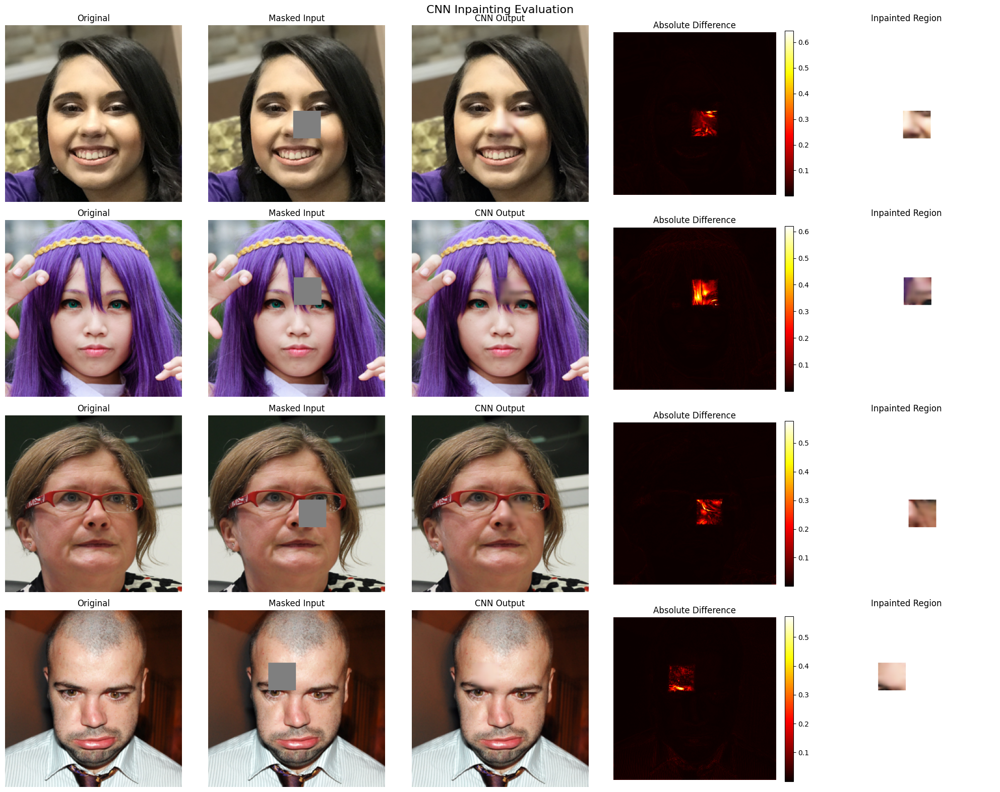

# VCS_Project
UniPD Vision and Cognitive Systems Final Project

https://ngldatascience.notion.site/inpainting_resDiff-23ae6e287a6880c78713f5fcb844e5f4

###  📊 CNN Inpainting Evaluation Results

| Metric | Value |
| :--- | :--- |
| **PSNR** | $39.14 \pm 1.69$ dB |
| **SSIM** | $0.9898 \pm 0.0029$ |
| **LPIPS** | $0.0099 \pm 0.0026$ |
| **FID** | $4.64$ |
| **Masked MSE** | $0.0147$ |
| **Masked MAE** | $0.1342$ |

---